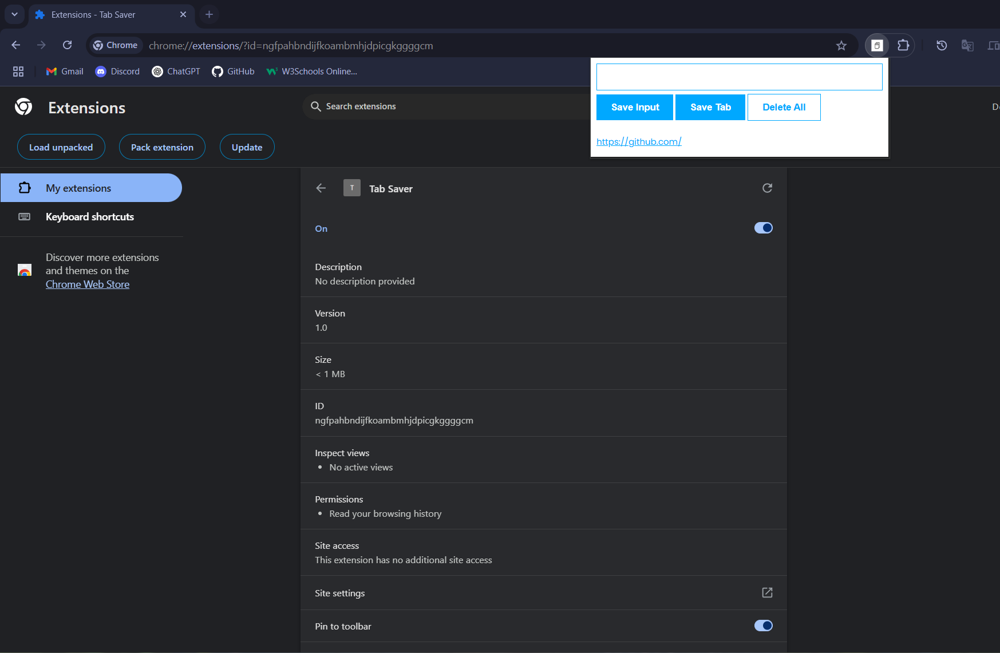

# 📌 Tab Saver – Chrome Extension

**Tab Saver** is a lightweight Chrome extension that lets you save, view, and manage your favorite tabs or URLs directly in your browser. Whether you’re researching, planning, or just collecting interesting links—Tab Saver helps you stay organized.

---

## 🖼️ Preview



---

## ✨ Features

- 🔖 Save the current tab with one click
- ⌨️ Manually enter and save a custom URL
- 📋 View all saved links as clickable items
- 🗑️ Clear all saved tabs with a double-click
- 💾 Persistent storage using `localStorage`

---

## 📂 Project Structure

```
Tab-Saver/
├── asset/
│   └── icon.png
|   └── Screenshot.png
├── css/
│   └── style.css
├── js/
│   └── index.js
├── index.html
├── manifest.json
└── README.md
```

---

## 🚀 Installation & Setup

1. Clone or download this repository.
2. Open Google Chrome and go to: `chrome://extensions`
3. Enable **Developer Mode** in the top right.
4. Click **"Load unpacked"** and select the project folder.
5. You're ready to use Tab Saver! 🎉

---

## 🧪 How to Use

- ➕ Click **"Save Input"** to add a URL manually.
- 🌐 Click **"Save Tab"** to store your current active tab.
- ✅ All links are saved below as a clickable list.
- ❌ Double-click **"Delete All"** to clear everything.

---

## ⚙️ Technologies Used

- HTML5
- CSS3
- JavaScript (Vanilla)
- Chrome Extension API
- localStorage for persistence

---

## 📄 License

This project is licensed under the MIT License.  
Feel free to fork it, use it, or contribute to improve it!

---
